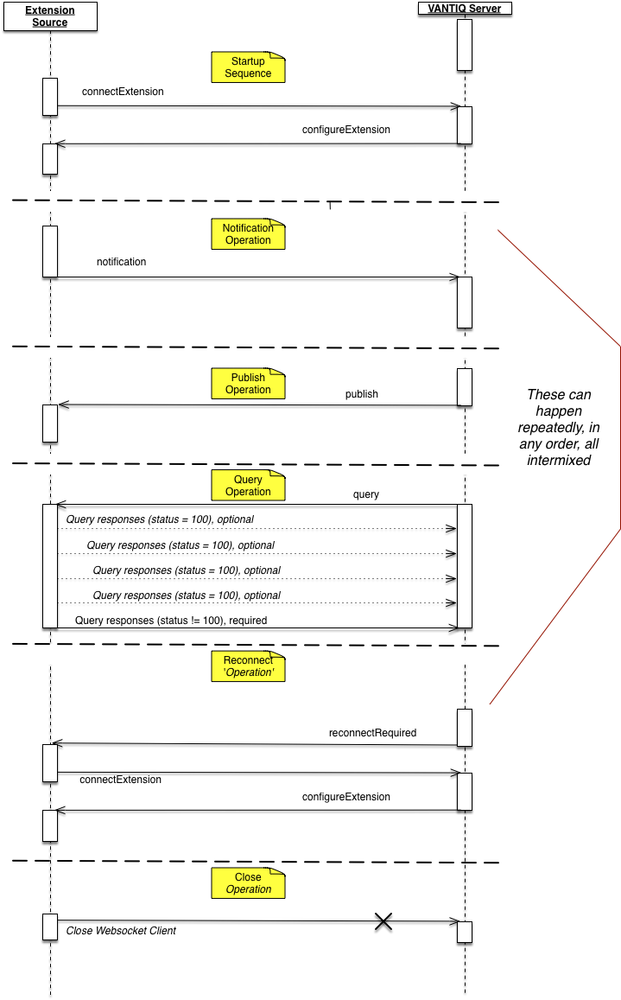
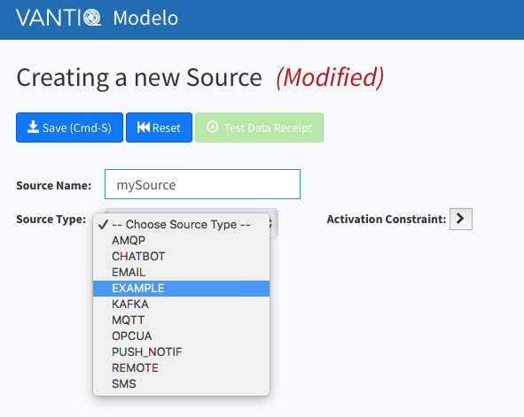
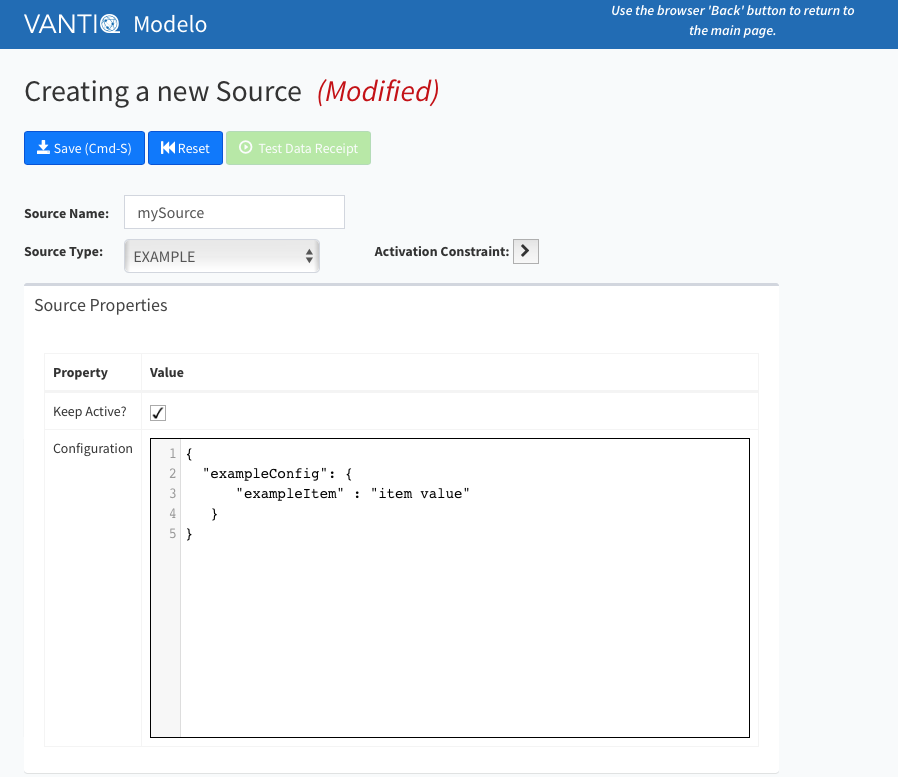

# vantiq-extension-sources

> Note:  Use Extension Sources requires VANTIQ Version 1.23 or later.

> Please ensure that the VANTIQ instance with which you are working has been
> updated to this version or later.
 
# Repository Overview

This repository contains the source code for various VANTIQ Extension Sources as well as SDKs for building these sources.  VANTIQ Extension Sources provide a means by which VANTIQ sources can operate outside of (but related to) a VANTIQ installation.

VANTIQ Extension Sources support the creation of VANTIQ source types.
Within a VANTIQ system, a *source* is the means by which the VANTIQ system communicates with other systems.
Each VANTIQ source has a *type* or *implementation*.
The source type determines defines the type(s) of system(s) with which the source can communicate.
The VANTIQ system has a variety of source types included,
but individual enterprises' situations will require connectivity to other systems.
These other systems may be other commercial or standard systems,
or they may be a *home-grown* system.
In any case,
the set of source types needs to be extensible.

VANTIQ Extension Sources provide this extensibility.
Working with the VANTIQ system,
an extension source can be constructed and operated outside the VANTIQ installation.
This allows these sources to fully participate in VANTIQ edge or full installations.

## Repository Contents & Conventions

The various directories within this repository represent either SDKs to build extension sources or extension sources themselves.
By convention, SDKs will end with `sdk`.

Each directory will contain a README (or README.md) file that describes the contents, and either contains or directs the reader toward appropriate documentation.
Each directory should contain a LICENSE (or LICENSE.md) file that outlines the license for the code as well as any packages used.

Bugs, Issues, Enhancement requests should be reported using the GitHub *issues* tab.
In any such report or request,
please make clear the extension source or SDK to which the issue applies.
Including the top level directory in the issue's `Title` is most expeditious way of doing so.
See [issue #33](https://github.com/Vantiq/vantiq-extension-sources/issues/33) for an example.

Some extensions sources present will be written and supported by VANTIQ;
others are contributed by other parties.

In general,
branches other than `master` are considered development or experimental branches.
Modulo any warnings or caveats in the README,
things in the `master` branch should be considered usable.

The repository is set up to require reviews of pull requests (PRs) going into master.
The primary purpose here is to maintain some level of consistency.

# Extension Sources Overview

Extension sources are used to allow VANTIQ to talk to various other systems.
Supported operations include

 - sending a message to the extension source,
 - having the extension source send a message to VANTIQ, and
 - querying the extension source.

It is important to understand that the interpretation of these operations
is determined completely by the extension source designer/developer.

For example, when sending a message to an extension source,
it might be the case that depending upon some parameter in the message,
the extension source might save the data, invoke some operation, or perform some other
action that is appropriate for the data system that source represents.

## Overall Architecture

The VANTIQ system maintains managers for each source type.
All extension sources are defined with a base type of EXTENSION (see [Defining a Type/Implementation](#defining_a_type)).
The extension source manager is responsible for the interaction between the extension sources and the remainder of the VANTIQ system.

Extension source connect to the VANTIQ system using websockets.
To enable extension sources behind firewalls, *etc.*,
the extension source must initiate connection to the VANTIQ system.
This connection must be authenticated before the extension source operations begin.

Once authenticated,
there are six (6) operations that define the extension source protocol.
These operations are as follows.

 - `connectExtension` -- how the extension source identifies itself to VANTIQ
 - `reconnectRequired` -- inform the extension source that it needs to reconnect
 - `configureExtension` -- VANTIQ provides source-specific configuration to the extension source
 - `publish` -- data sent from VANTIQ to the source
   - Result of a PUBLISH to the source
 - `notification` -- data sent from the source to VANTIQ
   - These appear as a message from the source
 - `query` -- queries sent from VANTIQ to the source with a response required.
   - results of a `SELECT` statements in VANTIQ

What follows is a general description of how things work.
For details in Java,
please see the [Java SDK](extjsdk/README.md).

## Messages

> Note:  When using the [Java SDK](extjsdk/README.md),
> generally you may not need this level of detail.

Messages are sent using an *ExtensionServiceMessage*.
This message contains the following properties.

 - `messageHeaders` – specific headers associated with this message
 - `op` – the operation in question
 - `resourceName` – in this case, `SOURCES`.
 - `resourceId `– the name of the source on which the operation is being requested
 - `object` – the underlying message appropriate for the operation
 - `contentType` – the type of the message.
   - At present, limited to `application/json`.

Response messages adopt the HTTP Codes by convention.
1xx indicate continuing work, 2xx is success, 300 or greater is an error.

## Operations

### connectExtension Operation

When an extension source is activated in the VANTIQ server, it is not connected.  Connection happens when the extension source contacts the VANTIQ system.  At that time, it establishes a session with the VANTIQ system, and further interactions take place in the context of that session.

In a `connectExtension` operation, the following properties are to be provided.

  - `op` -- the string `connectExtension`
  - `resourceName` -- the string `SOURCES`
  - `resourceId` -- the (string) name of the source connecting
    - This is the name the user assigned to a VANTIQ source, NOT the source type.

### reconnectRequired

The `reconnectRequired` message is sent when something has occurred that requires the source to reconnect.
The most common case for this is an alteration in the source's configuration.

Regardless of the reason,
when this message is received,
the source should being the connection process again,
starting at the `connectExtension` operation.

The websocket connection should still be up,
and the connection authenticated.

For this operation,
the following properties are provided.

 - `op` -- the string `reconnectRequired`
 - `resourceName` -- the string `SOURCES`
 - `resourceId` -- the name of the source for which the reconnect is required.

> Note that if you are using the [Java SDK](extjsdk/README.md),
> you can set `autoReconnect` to `true` and this process will be 
> handled automatically,
> provided that you have a `configHandler` set.

### <a id="configureExtension_operation"></a> configureExtension

Upon connection, the first operation sent by VANTIQ will be the configureExtension operation.  This operation will send the configuration document to the extension source, allowing it to perform whatever internal configuration it deems appropriate.

Properties provided in this operation are as follows.

 - `op` -- the string `configureExtension`
 - `resourceName` -- the string `SOURCES`
 - `resourceId` -- the name of the source being configured
 - `object` -- a JSON object.  The configuration document provided in the VANTIQ source definition will be in a property named `config`.

> Note:  At this time, the only data required for extension sources is the
> configuration document.
> At some point in the future, one or more additional properties may be required.
> See [note](#creating_config_doc) in [Defining a Type/Implementation](#defining_a_type)
> regarding configuration document structure.

### publish Operation

The `publish` operation on the source results when a VANTIQ application publishes something to the source.
As noted above, the interpretation of the `publish` operation is entirely up to the developer of the extension source.
The `publish` operation has no explicit semantics required.

The `publish` operation provides the following properties.

 - `op` -- the string `publish`
 - `resourceName` -- the string `SOURCES`
 - `resourceId` -- the name of the source to which the publish is destined
 - `object` -- the JSON message being published.

### notification Operation

The `notification` operation is data sent from the extension source to the VANTIQ system.
It will appear in VANTIQ as a message arriving from a particular source.
Within VANTIQ, a *rule* can be created to react to the message.

The `notification` message requires the following properties to be set.

 - `op` -- the string `notification`
 - `resourceName` -- the string `SOURCES`
 - `resourceId` -- the name of the source sending the notification
 - `object` -- the JSON message being sent to VANTIQ

### query Operation

The query operation is the only request-response style invocation.
We say request-response *style* invocation because it is not implemented as a request-response (implying synchronicity).

In this case, the EXTENSION source will receive a query operation.
The following properties will be provided.

 - `messageHeaders` -- a JSON object with the following properties
   - property name: `REPLY_ADDR_HEADER`, value: *the reply address to use in the response*
 - `op` -- the string `query`
 - `resourceName` -- the string `SOURCES`
 - `resourceId` -- the name of the operation to which the query is being sent
 - `object` -- a JSON message representing the query provided by VANTIQ

The query is taken from the WITH clause of the SELECT statement in VANTIQ.
For example, 
given the query

```
SELECT * FROM SOURCE opcExample as row WITH
            queryStyle : "NodeId",
            nsu : "urn:eclipse:milo:hello-world",
            nodeIdentifier : "HelloWorld/ScalarTypes/String"
    {
       ...
    }
```

the `object` property would contain the JSON string

```
{
    "queryStyle" : "NodeId",
    "nsu" : "urn:eclipse:milo:hello-world",
    "nodeIdentifier" : "HelloWorld/ScalarTypes/String"
}
```

In response, the query will respond with a HTML-style response.
This is a JSON message consisting of 
 
 - `status` – HTTP response statuses. Anything greater than or equal to 300 is considered an error here.
   - `200` – OK – any and all response contained in this message. 
   - `204` – No content.  All OK, but no data to return
   - `100` – chunking – all OK so far, data returned in message, but there may be more
 - `headers`
   - `X-Reply-Address` – contains the address of a reply (relevant for query only).  Contents should be obtained from the `messageHeaders` of the query message, specifically the header named `REPLY_ADDR_HEADER`.
   - `body` – the actual JSON body of the response.  For query, this can be
     - Map – the map represents a “row” in a select statement in VAIL
     - Array of Maps – this represents a bunch of rows.

If the status returned is an error, the reply address header & body should still be returned. 
Failure to return this will result in the query (on the VANTIQ) side waiting for the query to time out. 

In the case of an error, 
the body should contain an array of objects, each of which contains the following properties:

 - `messageCode`: A error code that might be used for message lookup or categorization.  This is a string, and it is generally specific to the server or class therein.
 - `messageTemplate`: A string that is the (in this case) the error.  Places where parameters should be substituted are represented by {#}, where the # is replaced by the number of the parameters array (see below), numbered from 0.
 - `parameters`: An array of parameters for the messageTemplate.

An example might be

```
[
    { “messageCode”: “com.example.sources.mysource.invalidQuery”,
      “messageTemplate”: 
      “The query: {0} is invalid for sources of type {1}”,
      “parameters”: [“hi there”, “mysource”]
    }
]
```

### Overall Protocol

The following diagram represents the overall flow of messages between an extension source and VANTIQ.



## <a id="defining_a_type"></a> Defining a Type/Implementation

### Creating the Source Type

When creating an Extension source, you must first create the source type or implementation. This is done by defining a file containing a JSON document with the following properties.

  - `name` -- the name of the source type you wish to create
  - `baseType` -- the string `EXTENSION`
  - `verticle` -- the string `service:extensionSource`
  - `config` -- an empty JSON object

To make the source type known to VANTIQ, use the VANTIQ CLI command _load sourceimpls_.


For example, suppose we are creating an extension source of type "EXAMPLE".
To do so, we would first create the file `exampleImpl.json` with the following contents:

```
{
   "name" : "EXAMPLE",
   "baseType" : "EXTENSION",
   "verticle" : "service:extensionSource",
   "config" : {}
}
```

Then, we would use the VANTIQ CLI to load that source implementation.

```
vantiq -s <profileName> load sourceimpls exampleImpl.json
```

where `<profileName>` is replaced by the VANTIQ profile name, and `exampleImpl.json` identifies the file containing the definition to be loaded.

Source Implementation documents may also include `baseConfigProperties`- a list of strings that represent source 
configuration options for the connector in question. By including this field, the listed configuration properties will 
automatically be made available for configuration by a Vantiq Assembly. Typically, the source config options included 
in the `baseConfigProperties` are the required properties for any instance of the connector. The following example 
demonstrates how to include the 'baseConfigProperties':

```
{
   "name" : "EXAMPLE",
   "baseType" : "EXTENSION",
   "verticle" : "service:extensionSource",
   "config" : {},
   "baseConfigProperties": [
        "exampleConfigOption",
        "nested.config.example1",
        "nested.config.example2",
   ] 
}
```

Once that type is loaded, you can create a source of that type. This is done by first selecting the EXAMPLE type for the source,



and then providing the configuration.



### <a id="creating_config_doc"></a>Creating the configuration document

You are _**strongly encouraged**_ to put the type-specific part of your configuration
in a separate property within the configuration, preferably named to match your
extension source type in some way.
In the future,
VANTIQ may need to include some general properties in this configuration,
so keeping things separated now will help in future proofing.

In our example above, for our EXAMPLE extension source type,
we have put the relevant configuration in the `exampleConfig` property within the configuration document.


Note that the format and contents of this document (at least the type-specific part) are to be understood by the extension source implementation.
Specifically, this JSON document is the configuration document delivered as part of the [`configureExtension`](#configureExtension_operation) operation.

# Developer Notes
To develop or build within this environment, we use `gradle` to build.

Some of the connectors require other software to build.
Generally, these are things that are not available as downloads via `gradle` dependencies,
or are things that are specific to each use.
For example,
building the JDBC connector requires that the developer building the connector provide
the appropriate JDBC driver to make the database connection.
In most cases, there is some environment variable that ends with `_LOC` (*e.g.* `JDBC_DRIVER_LOC`)
that specifies the location of the driver.

To allow developers to work on the connector in which they are interested without downloading
all possible options,
we have parameterized the top-level `settings.gradle` file.
The `settings.gradle` file determines the scope of the build.
Connectors requiring a driver are included in the overall build *only if* the associated driver location environment variable is present.
Otherwise, the connector is ignored for the build.

## Building Docker Images

The connectors in this repository contain `gradle` tasks that can be used to build Docker Images for each connector and 
push those images to the developer's Docker Registry. In order to use these tasks, the developer must include the 
following configuration option in their `gradle.properties` file or on the gradle command line,
along with some optional parameters:

*   `dockerRegistry`: Required. The name of the registry to which the image should be pushed (i.e. `docker.io`,
`quay.io`, etc.).
Note that this is used in naming the image even if you do not request publishing.
*   `pathToRepo`: Required. The path to the docker repository. This is typically the `namespace` portion of registry
URIs that follow the `registry/namespace/repo:tag` structure, but each registry can vary, (i.e. `pathToRepo=/vantiq/`).
Note that here, too, this is used in naming the image even if you do not publish.
Generally, this must be numbers and lowercase letters, starting with a letter.
*   `dockerRegistryUser`: Optional. The username used for authenticating with the given docker registry.
If not provided, this will be set to the empty string.
If you are publishing, you will generally need this value.
*   `dockerRegistryPassword`: Optional. The password used for authenticating with the given docker registry.
If not provided, this will be set to the empty string.
If you are publishing, you will generally need this value.
*   `imageTag`: Optional. The tag used when pushing the image. If not specified, the tag will default to "latest".
*   `repositoryName`: Optional. The name of the repository in the registry to which the image should be pushed. If not
specified, the default repository will be the connector's name (i.e. "jdbc-source", "jms-source", 
"objectrecognition-source", etc.).
*   `connectorSpecificInclusions`: Optional. The path to a directory of files that need to be included in the image. 
These can then be referenced and used by the Dockerfile.

Note that the `repositoryName` and, most likely, `connectorSpecificInclusions`, will be most appropriate on the
gradle command line.
Otherwise, the `repositoryName` will be used for all connectors built,
and that will be overwritten by the last one built.

With the required properties in place, the tasks can then be executed as follows:

### Build Image

From the root directory of this repo, run the following command (this example builds the JDBC Connector)
```
./gradlew jdbcSource:buildConnectorImage
```

Or, you can just run the following task:
```
./gradlew jdbcSource:buildImages
```
*   **NOTE:** This last option will build all images configured for a given subproject. Currently, each subproject 
(connector) is only configured to build one image. If the developer modifies any of the `build.gradle` to configure more
than one image, this command will build them all.

### Push Image

From the root directory of this repo, run the following command (this example pushes the JDBC Connector image)
```
./gradlew jdbcSource:pushConnectorImage
```

Or, you can just run the following task:
```
./gradlew jdbcSource:pushImages
```
*   **NOTE:** Same note as the one above.

### Deploying the connector images in the Vantiq IDE

Once you have built and published the docker image for a given connector (as described above), you can then deploy it 
into a Kubernetes Cluster directly from the Vantiq IDE. This process is described in its entirety 
[here](https://dev.vantiq.com/docs/system/extlifecycle/index.html), including both the prerequisite Kubernetes Cluster 
setup, and an example that deploys the JDBC Connector.