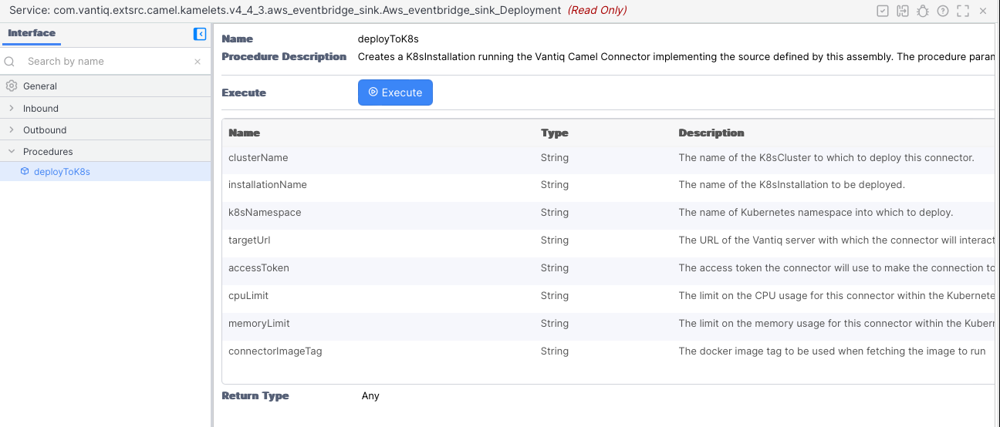
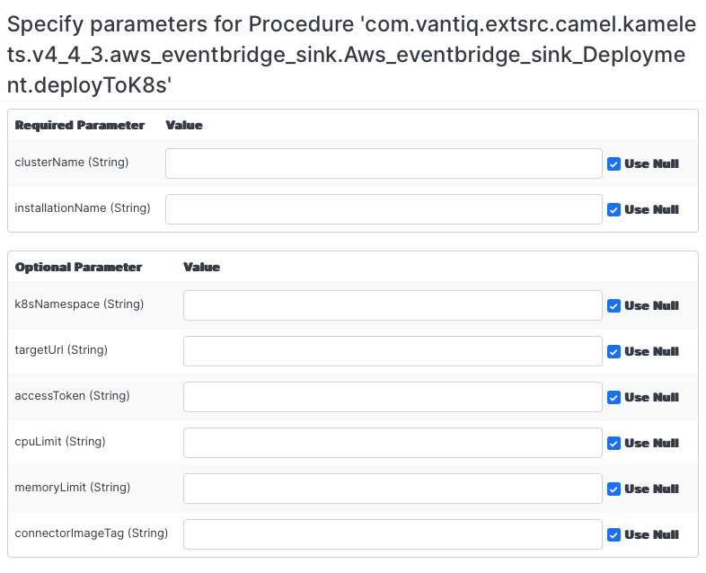

# Overview

This document outlines the contents of the `CamelAssemblies` subproject within the extension sources repo.

The `CamelAssemblies` subproject creates Vantiq projects from
[Camel Kamelet Definitions](https://camel.apache.org/camel-kamelets/3.21.x/). These projects will
be made available in a Vantiq Public Catalog as _Vantiq assemblies_. These assemblies, when imported,
create Vantiq services and sources for connections to or from external systems supported by Apache Camel.

# Prerequisites 

**IMPORTANT:** A basic understanding of the [Vantiq Camel Connector](../camelConnector/README.md) is assumed.

All assemblies contained herein (Vantiq Camel assemblies) are built atop the base Camel Connector assembly, 
`com.vantiq.extsrc.camelconn.camelConnector`.  Specifically, the Camel Connector 
assembly defines the Camel Connector source implementation type and the schema type
`com.vantiq.extsrc.camelcomp.message` that defines the message format for messages used between the Camel connector
and the Vantiq system.

# Repository Contents

Apache Camel, briefly, is organized into a set of _components_ that are used to integrate with other software 
systems. The Vantiq Camel Connector provides the ability to load the components necessary to operate _routes_, 
Camel's means for describing the interaction between information systems.

Apache Kamelets are packages containing the routes and associated settings needed to set up connections using Apache
Camel-K. 

The assemblies generated by this subproject take the information contained in the Kamelet
definitions, constructing
Vantiq Camel assemblies that contain services and Vantiq sources ready to use in a Vantiq system.
This subproject will generate Vantiq assemblies from the Camel definitions downloaded 
as the `camel-kamelet` library from the dependencies (see the `build.gradle` file in this subproject).
To generate the assembles, just run `../gradlew assemble`. After that, the Vantiq assemblies will be
located in zip files under the build/distributions directory.
For example,`build/distributions/ftp_sink_v3_21_0.zip`.

## Terminology and Naming

Generally, there are two Vantiq Camel assemblies provided for each system for which assemblies are created. Assemblies 
for 
sending data _to_ another system are thought of as _sinks_, and have the word `sink` in the assembly name and the
names of the included Vantiq components. Those that get data _from_ another system have the word `source` in the names.

Each assembly and its included components are named including the name of the system with which they
interact and the Apache Camel version in use (kamelets are Camel version specific).  For example, an assembly using 
Camel version 3.21.x for consuming information from Amazon's AWS S3 will be in the Vantiq Camel assembly

    com.vantiq.extsrc.camel.kamelets.v3_21_0.aws_s3_source

while an assembly for sending data to Amazon's AWS SNS will be found in

    com.vantiq.extsrc.camel.kamelets.v3_21_0.aws_sns_sink

For each of these cases, the Vantiq components contained in the assembly will have that assembly name as their 
package name. The _base name_ for Vantiq components will be the kamelet name, with suffixes specific to the Vantiq 
component type.

Each Vantiq Camel assembly is realized via a [Vantiq Camel Connector](../camelConnector/README.md). The connector is 
configured to make the connection to the associated information system via the Camel route defined in the assembly.

## Constructed Vantiq Camel Assemblies

The Vantiq Camel assemblies contained herein are composed of the following.

* Vantiq Source -- this is the Vantiq component that represents the external system to the Vantiq environment.
  * The Vantiq source will be of type `CAMEL`. This is defined in the Camel Connector assembly `com.vantiq.extsrc.camelconn.camelConnector`.
  * The source's configuration will include the Camel route to/from (source/sink) the external source via Camel 
    Component(s).
  * The configuration may include configuration information (such as credentials, type of interaction) generated 
    from Vantiq assembly configuration parameters.
  * The Vantiq source is in the package matching the assembly name, with the name consisting
      of the base name with the suffix `_source`.
* Vantiq Service -- this is the Vantiq item with which Vail code interacts.
  * The service interacts with the Vantiq source to move information to/from the Vantiq system.
  * The service is in the package matching the assembly name, and named with the base name with the suffix 
    `_service`.  For example, `com.vantiq.extsrc.camel.kamelets.v3_21_0.aws_sns_sink.aws_sns_sink_service`.
  * Each service is defined with an _inbound_ or _outbound_ event named with the base name with the suffix 
    `_serviceEvent`. Continuing the example above, `aws_sns_sink_serviceEvent` (so the full service event name is 
    `com.vantiq.extsrc.camel.kamelets.v3_21_0.aws_sns_sink.aws_sns_sink_service/aws_sns_sink_serviceEvent`).
* Vantiq Rule -- this is the Vantiq component which marshals events between the Vantiq source and Vantiq service.
  * The rules are in the package matching the assembly name, and named using the associated 
       service name with the suffix `_srcToSvc` (for a _sink_ assembly)
       or `_svcToSrc` (for a _source_ assembly).
* Vantiq Documents -- there are a few documents that may be present in the Vantiq Camel assembly.
  * Overview Document -- `<assembly name>_overview.md`.  This contains the provided high-level description of the 
    assembly. It will often provide other information concerning use of the assembly such as Camel headers required 
    for use, the Vantiq Source created, etc.
  * Route Template Document -- `<assembly name>_routes.yaml`.  This is the routing information used by the Camel 
    Connector. It is referenced by the Vantiq Source configuration.
  * Notes Document (optional) -- `<assembly name>_notes.md`.  When present, this contains information that Vail 
    developers need to know about use of the assembly. Typically, this is information regarding non-standard message 
    structure or functionality. The assemblies are interacting with external systems whose methods of operation are 
    different from that of Vantiq. Amongst other things, the _notes_ document(s) are used to communicate this 
    information when required.

# Vantiq Camel Assemblies in a Vantiq Namespace

## Vantiq Camel Assembly Installation

To make use of any Vantiq Camel assembly defined herein, the user should perform the following tasks.

* Add the Vantiq Catalog containing the definitions. In Vantiq public systems, this is, at the time of this writing, 
  named `CamelCatalog`. This must be done once per namespace into which any of these assemblies will be installed.
* From that catalog, import the `com.vantiq.extsrc.camelconn.camelConnector` assembly. This is a prerequisite for 
  the Vantiq Camel assemblies.  See the [Camel Connector document](../camelConnector/README.md).
  * As with the addition of the Vantiq Catalog, this needs to be done once per Vantiq namespace in which these 
    assemblies are being used.
  * This assembly defines the following items:
    * The `CAMEL` source implementation type.
    * The Vantiq _schema_ used for the _structured messages_ used to interact with the source.
    * A deployment procedure used to deploy the connector to Kubernetes via a Vantiq K8sCluster.
* From that catalog, import the Vantiq Camel assembly or assemblies desired, providing the configuration properties as 
  requested. 
  * These configuration properties
  will often include addressing information and credentials for the remote systems. It is strongly suggested that 
    credential information (or other confidential information) be stored in Vantiq 
    Secrets, and referenced using the `@secrets()` notation.

## Using the Vantiq Camel Assemblies

Once installed, each Vantiq Camel assembly creates a source & service for interacting with that source.

The source is defined, but it is implemented via a [Camel Connector](../camelConnector/README.md). To run the Camel 
Connector, please see the [Camel Connector overview](../camelConnector/README.md).

As noted above, the service will have an inbound or outbound event defined, and interactions with the service are
generally performed by publishing to that event or handling it (for _inbound_ or _outbound_ events).
All are constructed to use _structured messages_ as defined by the 
[Camel Component](../camelComponent/README.md#structured-headers-and-messages). Consequently, messages sent to/from 
the service should be in this format. Specifically, such messages contain two (2) properties: `header` and `message`,
where the `header` property contains the Camel headers, and the `message` property contains Camel message.
The associated Vantiq _schema_ is defined via the `com.vantiq.extsrc.camelconn.camelConnector` assembly imported as 
described above.  This imported assembly is a prerequisite for the other Vantiq Camel assemblies.

**Note**: Some of these Vantiq Camel assemblies (specifically those that work with systems
with limited messaging capabilities),
the Vantiq Component will construct output messages (the `message` property) with a single 
property (`stringVal` or `byteVal`) containing the 
message content. This allows Vantiq applications to interact in a Vantiq application native manner.
Users of these systems will need to be aware of this _impendance mismatch_ and respond accordingly.

## Logging & Debugging

These Vantiq Camel assemblies themselves provide no direct support for logging or debugging -- they are simply 
specifications for 
Apache Camel applications. To debug what is happening, you will need to look at the component definitions used in 
the assembly.  Generally, these will include the component for the target system and the [Vantiq component](../camelComponent/README.md).
Information about other components is (usually) found in the 
[Apache Component catalog](https://camel.apache.org/components/3.21.x/index.html).

# Deploying the Camel Connector to Kubernetes

Assuming you have K8sCluster defined in your Vantiq namespace, you are free to deploy the installation using the 
usual Vantiq tools.  The name of the source defined by the assembly is provided in the overview document (and 
the assembly description in the catalog).

However, to make this simpler, each assembly includes connector deployment service that can be 
used to perform this function. 

Each assembly contains such a service for performing the deployment. The service is in the same package as other things 
within the assembly, and is named using the base name with the `_Deployment` suffix.  So, for example, the 
deployment service for the AWS EventBridge sink is

`com.vantiq.extsrc.camel.kamelets.v3_21_0.aws_eventbridge_sink.Aws_eventbride_sink_Deployment`

with the deployment procedure being

`com.vantiq.extsrc.camel.kamelets.v3_21_0.aws_eventbridge_sink.Aws_eventbride_sink_Deployment.deployToK8s()`

The actions required to perform the deployment are the same as those described for 
[deploying a Camel Connector](../camelConnector/README.md#camelConnectorDeployment) with two (2) differences:

1) The service and procedure to use varies from assembly to assembly
  (they are named and packaged as per the assembly), and
2) The source name value is not (cannot) be provided.  It is provided by the assembly and the specialized service 
   contained therein.

So, using the same assembly as an example, assembly installation will provide the service definition

From there, you can execute the `deployToK8s` procedure by pressing the _Execute_ button.

which will present you with a set of parameter values to provide.

As with the underlying Camel Connector (on which these assemblies are based), the `clusterName` and 
`installationName` values are required, but the remainder are optional.  They will take their defaults from the 
Camel Connector assembly installation or from the system.

# Licensing

The source code uses the [MIT License](https://opensource.org/licenses/MIT).  

okhttp3, log4j, gson, and jackson-databind are licensed under
[Apache Version 2.0 License](http://www.apache.org/licenses/LICENSE-2.0).  

slf4j and lombok are licensed under the [MIT License](https://opensource.org/licenses/MIT).  

Apache, Camel, and Apache Camel are trademarks of the Apache Software Foundation and are licensed under
[Apache Version 2.0 License](http://www.apache.org/licenses/LICENSE-2.0). 
