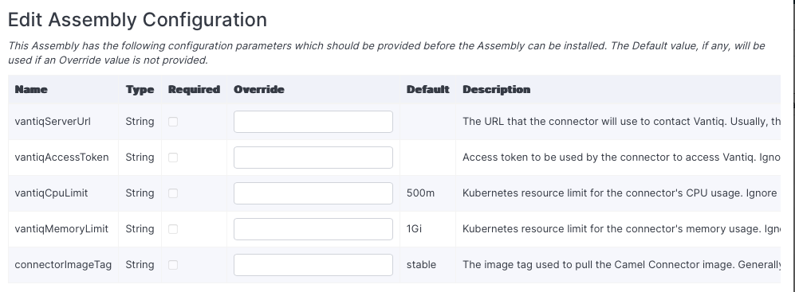
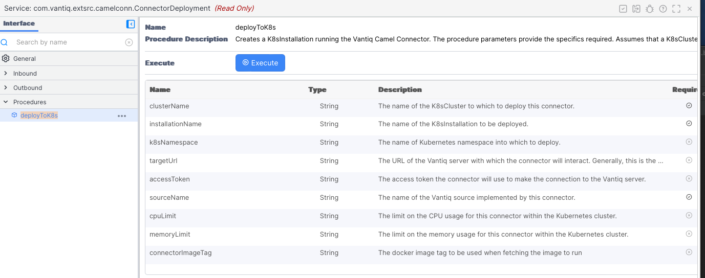

# Overview

The following documentation outlines how to incorporate an Apache Camel Connector and associated Vantiq SOURCE into part of your project.
This allows a user to 
construct Apache Camel applications that interact with Vantiq.

The Apache Camel Connector constructs the environment necessary to run an Apache Camel Application.
It uses the [Vantiq Camel Component](../camelComponent/README.md) (if necessary). The building of an Apache Camel
application usually involves building the application, including the dependencies, using the Maven system
(constructing POM.xml files, etc.).

The Vantiq Apache Camel Connector is configured with the Camel application desired, and, using that definition,
discovers, downloads, provisions the connector, running the application using the appropriate Apache Camel
Components as specified in the routes included in the configuration.  Within the Vantiq system, the connection point will be a Vantiq Source.

In order to incorporate this Extension Source, you will need to create the
Source in the VANTIQ Modelo IDE. The documentation 
has been split into two parts, [Setting Up Your Machine](#machine) and [Setting Up Your VANTIQ Modelo IDE](#vantiq).

## Details

When using the Camel connector, the connector makes a discovery pass to find the components required.  Then, it
downloads them and constructs a class loader including the components needed. Thus, when using the connector,
you need only supply the routes (and any specific connection properties you may need),
and the connector finds & resolves the Apache Components & Dataformats required,
and then runs your application.  We generally expect this will involve Vantiq, but it need not.

Discovery, at a high level, operates more or less as follows. An Apache Camel system operates 
with what is called a CamelContext. This provides the directory of directories to what's going on.
Within the context, one can replace the component resolver and data format resolver -- there are a
number of special purpose resolvers within the Camel system.
Generally, the default ones know how to load the components required via the metadata in the jar files.

In the camel connector, discovery operates by providing its own so-called `Enumerating`
component & data format resolvers. These operate by saving the information about what is required, 
and providing a `PlaceHolder` parts to allow Apache Camel to think it is operating. Once Camel
thinks it has successfully started, the connector stops it, using the information from
the `Enumerating`*`Resolver`s to get the list of components and data formats required.

From that list, we construct the set of libraries required and download those libraries and their 
dependencies. This is done using Apache Ivy. Once downloaded, we construct a `URLClassLoader`
that we set up as Camel's application class loader, 
construct a new CamelContext (with that class loader but no special resolvers), 
and let Camel operate the Camel application in its normal manner.

# Prerequisites <a name="pre" id="pre"></a>

**IMPORTANT:** Read the [Testing](#testing) section before building this project.

An understanding of the VANTIQ Extension Source SDK is assumed. Please read the [Extension Source README.md](../README.md) for more 
information.

The user must [define the Apache Camel Connector Source implementation](../README.md#-defining-a-typeimplementation)
in the Vantiq system. For an example of the definition, 
please see the [*camelConnectorImpl.json*](src/test/resources/camelConnectorImpl.json) file
located in the *src/test/resources* directory.

# Building and Running the Connector Locally

## Setting Up Your Machine <a name="machine" id="machine"></a>

### Repository Contents

The _connector_ directory (`src/main/java/io/vantiq/extsrc/camelconn/connector`) contains the following files:

*   **CamelMain** -- The main function for the program. Connects to sources as specified in a
    configuration file.
*   **CamelCore** -- Coordinates the connections to the database, and sends the resulting data back to VANTIQ Modelo if
    necessary.
*   **CamelHandleConfiguration** -- Sets up the Apache Camel routes based on the source's configuration document, and
    initializes the queryHandler and publishHandler.

The _discovery_ directory (`src/main/java/io/vantiq/extsrc/camelconn/discover`) contains a variety of classes
implementing the discovery, resolution, and provisioning of the components necessary to run the Apache Camel
application configured as part of the source.

### How to Run the Program <a name="runtheconnector" id="runtheconnector"></a>

### Running the Program Locally

1.  Clone this repository (vantiq-extension-sources) and navigate into `<repo location>/vantiq-extension-sources`.
2.  Run `./gradlew camelConnector:assemble`.
3.  Navigate to `<repo location>/vantiq-extension-sources/camelConnector/build/distributions`. The zip and tar files both contain 
    the same files, so choose whichever you prefer.
4.  Uncompress the file in the location that you would like to install the program.
5.  Run `<install location>/camelConnector/bin/camelConnector` with a local server.config file or specifying the [server config file](#serverConfig) as the first argument. Note that the `server.config` file can be placed in the `<install location>/camelConnector/serverConfig/server.config` or `<install location>/camelConnector/server.config` locations.

#### Changing Camel Versions

The camelConnector has been tested with the version of Apache Camel defined in the `build.gradle` file.
If you wish to change this, you will need to perform the following actions:

1. Change the `camelVersion` property in the `build.gradle` file.
2. Update the `artifactMap.json` found in `src/main/resources`. This file is the list of components and data formats provided by the Camel version in question.  To update this map, you will perform the following actions.
   1. Clone the [Apache Camel source repository](https://github.com/apache/camel)
   2. Set the `camelRoot` gradle property to the  root directory of the cloned repo above.
   3. Run the `./gradlew camelConnector:generateComponentList` command.  This will take a little while as it examines the source code in question to determine the set of components and data formats provided. This list is used when determining the set of libraries required to provision the connector for your Apache Camel application.

### Logging

To change the logging settings, edit the logging config file
`<install location>/camelConnector/src/main/resources/log4j2.xml`,
which is an [Apache Log4j configuration file](https://logging.apache.org/log4j/2.x/manual/configuration.html). The logger 
name for each class is the class's fully qualified class name, *e.g.* "io.vantiq.extjsdk.ExtensionWebSocketClient".  

<a name="serverConfig" id="serverConfig"></a>
### Server Config File

(Please read the [SDK's Server Config File documentation](../extjsdk/README.md#serverConfig) first.)

#### Vantiq Options

*   **authToken**: Required. The authentication token to connect with. These can be obtained from the namespace admin.
*   **sources**: Required. A comma separated list of the sources to which you wish to connect. Any whitespace will be
    removed when read.
*   **targetServer**: Required. The Vantiq server hosting the sources.

# Setting Up Your VANTIQ Modelo IDE <a name="vantiq" id="vantiq"></a>

## Source Configuration <a name="sourceConfiguration" id="sourceConfiguration"></a>

To set up the Source in the VANTIQ Modelo IDE, you will need to add a Source to your project. Please check the [Prerequisites](#pre) 
to make sure you have properly added a Source Definition to VANTIQ Modelo. Once this is complete,
you can select CAMEL
(or whatever you named your Source Definition) as the Source Type. You will then need to provide the
Source Configuration Document.

The Configuration document may look similar to the following example:

```json
    {
       "camelRuntime": {
         "appName": "myCamelAppName",
         "routesDocument": "someVantiqDocName.xml"
       },
      "general": {
      }
    }
```

### Options Available for camelRuntime

* **appName**: Optional -- name of the app.  If not provided, default to _camelConnectorApp_.
* **routesDocument** or **routesList** and **routesFormat**: Required. This is the list of Camel routes to run.
    * **routesDocument** -- the name of a Vantiq Document containing the XML or YAML definition of the routes to run. The format of the document (XML or YAML) will be determined from the file name (_e.g._, `routes.xml`)
    * **routesList** and **routesFormat** -- the XML or YAML specification of the Camel routes to run.  The **routesList** property should contain the appropriate text, and the **routesFormat** should contain either `xml` or `yml` indicating the style used to specify the routes.
      * *Note*: You must specify either the **routesDocument** or **routesList** _AND_ **routesFormat** properties, but not both.
* **componentProperties** -- a list of JSON objects which contain the component name & associated properties. These are used by some components for their configuration and/or operation. Values here may include security information (clientId or tokens).
    * The format of this values is a list of JSON objects, where each JSON object contains a **componentName** property containing the name of the component for which these properties are to be applied, and **componentProperties** containing a Json object consisting of property names and values.
    * For example, if we needed to define the `clientId` and `securityToken` properties for the `example` component, we would add the following to the `camelRuntime` section of the source configuration.
  
        ```json
        {
            "camelRuntime": {
            ...
            "componentProperties": [
                {
                    "componentName": "example",
                    "componentProperties": {
                        "clientId": "me@example.com",
                        "securityToken": "someExampleToken..."
                    }
                }
           ],
           ...
           }    
        }
        ```

* **propertyValues** -- a JSON object where each property specifies the name and value to be provided for the Apache Camel property placeholder. [Property placeholders](https://camel.apache.org/manual/using-propertyplaceholder.html) can be used in Camel routes to supply values at the route configuration time. 
    * For example, to provide values for the properties `name` and `company`, you would add the following the the `camelRuntime` section.
  
    ```json
    {
        "camelRuntime": {
            ...
            "propertyValues": {
                "name": "fred",
                "company": "vantiq"
            }
            ...
        }
   }
   ```

### Options available for general

*   **componentCacheDirectory** -- (Optional) the name of a directory into which to place the downloaded components for use later.  If absent, defaults to `componentCache`.
*   **componentLibraryDirectory** -- (Optional) The name of the directory into which to place component libraries (and associated dependencies) for running.  It is from here that the required component classes will be loaded.  If not present, defaults to `componentLib`.
*   **repoList** - (Optional) A list of URLs for Maven repositories from which to load components.  If absent, defaults to _maven central_.
*   **additionalLibraries** -- (Optional) A list of libraries to include _in addition to_ those found via discovery. These should be specified as "<group>:<name>:<revision>" triples.

### Defining Camel Routes that include Vantiq

The [Vantiq Camel Component](../camelComponent/README.md) has details on how to define a Vantiq Camel Endpoint.
The Vantiq Camel Component, itself, is not a full-connector -- it uses the connector protocol to
manifest the component.

That said, the Vantiq Camel Connector is a full connector, requiring the `server.config` file 
as outlined [here](#runtheconnector).
In most cases, the Camel Application will contain Vantiq endpoints,
and these endpoints will refer to the Vantiq server specified in the `server.config` file.

Rather than re-specifying this information, the Vantiq Camel Connector provides a mechanism
whereby routes including Vantiq endpoints can refer to the Vantiq specified in the `server.config` file. 
This is done by specifying a Vantiq endpoint
that uses `server.config` as the host name.  That is, specify a route like the following route
that accepts message from the Vantiq server specified in the connector's `server.config` file and logs the result.

```xml
    <routes xmlns="http://camel.apache.org/schema/spring" >
        <route id="xml-route">/
            <from uri="vantiq://server.config"/>
            <to uri="log:INFO"/>
        </route>
    </routes>
```

#### Connector Operation

Upon startup (or when the Vantiq Source configuration changes), the Camel Connector will examine the configuration
to determine the route(s) to run. To configure itself, the connector will perform the following actions:

* Read the configuration and determine the route(s) to be used.
* Start the Camel routes in an internal _discovery_ mode where the components required to run the routes are
discovered.
* Based on the discovered components, download the required libraries and their dependencies.
    * If the **additionalLibraries** property is provided as part of the configuration, the libraries listed
therein are downloaded as well.
    * The downloads happen based on the Maven Central repository, unless the **repoList** property is specified
in the configuration.  If that is present, that list is used _instead_ of the Maven Central repository. Thus, if
one wishes to add a repo in addition to Maven Central, one must include the Maven Central repository in the list.
This allows the configurer to override things for testing, etc.
* Once the downloads are completed, the runtime is augmented with the required components,
and the Camel application is started (in _normal_ mode) to run the route(s) requested.
* This discovery process happens on each restart or reconfiguration.
However, libraries already downloaded will not be downloaded again (unless a version update is required).
    * To force a new download, clear the directory specified (or defaulted) by the **componentCacheDirectory**
configuration property.

## Messages to the Source

Messages are sent to the source as _notifications_, and are delivered as _events_ to the associated source.
Messages sent to Vantiq from the component/connector will
arrive as VAIL objects, where the property names correspond to the Map keys.
The Vantiq Component expects messages in an exchange to arrive in the form of a Java Map.  However, messages arriving
in JSON format will be accepted as well.
When constructing your Camel Application, you must keep this in mind.

## Messages from the Source

Messages that are sent to the component will arrive in a Camel Exchange as a Java Map, where the keys in the map
correspond to the property names in the object sent from Vantiq.  

## Select Statements

In order to interact with the Apache application, one option is to use VAIL to select from the source. To do this, you will need 
to specify query message using the WITH clause on the VAIL SELECT statement. The data will be returned to 
VANTIQ as a set of _rows_, where each _row_ contains a set of properties.

The following example uses a VAIL Select Statement to **query** an application:
```js
PROCEDURE queryCamel()

try {        
    // Normal SELECT Statement in VAIL, but using WITH Clause is important.
    SELECT ONE * from SOURCE camelConnectorSource as result WITH 
        value1: "some value",
        value2: 35
     
    // We expect a result with a property named "answer"...
    
    var ourAnswer = result.answer
    
} catch (error) {
    // Catching any errors and throwing the exception.
    exception(error.code, error.message)
}
```

In this example, we expect only one row to be returned.

## Publish Statements <a name="publish" id="publish"></a>

Another method to interact with the Camel application is to use VAIL to publish to the source. 
To do this, you will need to send the desired VAIL object to your application using the Publish parameters.
The following VAIL procedure will send data to the Camel application by sending an event to the associated source.

```js
PROCEDURE publishToCamel(valueToSend Integer)
    PUBLISH {value: valueToSend} to SOURCE camelConnectorSource
```

## Error Messages

Query errors originating from the source will include the code and error message.
They may also include the cause (the underlying exception).

## Testing <a name="testing" id="testing"></a>

In order to properly run the tests, you must add properties to your _gradle.properties_ file in the _~/.gradle_
directory. These properties include the Target VANTIQ Server URL, as well as an Access Token for that server. 
The Target VANTIQ Server and Auth Token will be used to create a temporary VANTIQ Source, VANTIQ Type, 
VANTIQ Topic, VANTIQ Procedure and VANTIQ Rule.
Some tests may require other gradle properties as well.

* **NOTE:** We strongly encourage users to create a unique VANTIQ Namespace in order to ensure that tests do not
accidentally override any existing Sources or Types.

# The Camel Connector Assembly

This repository defines a Camel Connector Assembly (`com.vantiq.extsrc.camel4conn.CamelConnector`) which can be
imported into a Vantiq catalog. Some Vantiq installations will contain a public catalog (the _Camel Catalog_) that
contains this assembly.

The assembly, once imported, defines the following Vantiq entities.

* The CAMEL Source Implementation.  This is used to [define the Vantiq Source](#sourceConfiguration).
* The `com.vantiq.extsrc.camelcomp.message` schema type.
    See [Camel Component Structured Messages](../camelComponent/README.md#structuredMessages)
* The `com.vantiq.extsrc.camel4comp.ConnectorDeployment` service, including the `deployToK8s()` procedure.

Once this assembly is installed, these items are available for use in the namespace in which the assembly is installed.
Use of the source implementation and the schema type are outlined in the links provided.

## Namespace Setup

Use of the `ConnectorDeployment` service requires that the following Vantiq components exist in the Vantiq namespace 
in which you are working.

* K8sCluster -- you need to have a K8sCluster (Vantiq's representation of a Kubernetes cluster) set up.
* Vantiq Source -- you need to have a Vantiq Source defined.  This is the point of interaction for the Vantiq 
  applications with the connector.  See [Vantiq Source Configuration](#sourceConfiguration)
* Access Token -- you need a Vantiq Access Token defined that the connector will use to connect to Vantiq
* Secrets -- it is strongly recommended that you define Vantiq Secrets for any credential or credential type things. 
  These credentials include the Vantiq Access token as well as any confidential information that the Camel Component(s)
  you are using may require.

## Installing the Camel Connector Assembly <a name="assemblyInstallation" id="assemblyInstallation"></a>

When the Camel Connector Assembly is installed, it will _ask_ for a number of configuration property values.



These are all optional for the installation.  If provided, they provide defaults for the deployment of connectors.  
The following properties are presented.

* **vantiqServerUrl** -- this is the URL the connector will use to contact the Vantiq server.  Generally, this is 
  the schema, node, and, optionally, port that one would use in the browser. If not provided, the system can 
  generally determine this.  However, if you are, say, running in a local Kubernetes cluster that has a different 
  network configuration, you may need to provide this.  (Note that _localhost_ is generally a bad node name to use.)
* **vantiqAccessToken** -- this is the access token created for the connectors use in contacting the Vantiq server.  
  It is strongly recommended that you create a Vantiq secret and use the `@secrets()` notation for the property value.
* **vantiqCpuLimit** -- this is the Kubernetes CPU limit for the installed connector. Except for some specialized 
  circumstances, this can be left empty.
* **vantiqMemoryLimit** -- this is the Kubernetes memory limit for the installed connector. Except for some specialized
  circumstances, this can be left empty.
* **connectorImageTag** -- this is the Docker image tag used to fetch the image into Kubernetes.  Unless you have 
  created your own image, this should be left blank.

When provided for the assembly installation, the values provided become default values when the deployment procedure
is used (in place of the system provided defaults).


## Using the `ConnectorDeployment` Service <a name="camelConnectorDeployment" id="camelConnectorDeployment"></a>

(Note: this section assumes that you have set up the items outlined [above](#namespace-setup))

After installing the assembly, you can open the installed `com.vantiq.extsrc.camelcomp.ConnectorDeployment` 
(`ConnectorDeployment`). 




Select the `deployToK8s` procedure, and press `Execute`.


The parameters are described below.

Required Values:

* **clusterName** -- this is the name of the Vantiq K8sCluster to which to deploy the connector.
* **installation** -- this is the name of the installation to be deployed.
* **sourceName** -- the name of the Vantiq Source that this connector will implement

Optional Values:

* **k8sNamespace** -- the namespace within the Kubernetes cluster into which to place the installation.
* **targetUrl**, **accessToken**, **cpuLimit**, **memoryLimit**, **connectorImageTag** -- described 
  as part of the [assembly installation process](#assemblyInstallation).  _Note that there are system provided or 
  determined values for most of these, the **accessToken** (or **vantiqAccessToken**) must have a value provided 
  either at invocation or installation time._

Once you run the `ConnectorDeployment.deployToK8s()` procedure, the Vantiq system will arrange for the deployment of 
the installation. Information about this process is available as part of your Vantiq documentation.

Note that the deployment will pull the Camel Connector image from quay.io.  The image is made available in a public 
repository, so no credentials are required.

## Licensing

The source code uses the [MIT License](https://opensource.org/licenses/MIT).  

okhttp3, log4j, gson, and jackson-databind are licensed under
[Apache Version 2.0 License](http://www.apache.org/licenses/LICENSE-2.0).  

slf4j and lombok are licensed under the [MIT License](https://opensource.org/licenses/MIT).  

Apache, Camel, Apache Camel, Ivy, and Apache Ivy are trademarks of the Apache Software Foundation and are licensed under
[Apache Version 2.0 License](http://www.apache.org/licenses/LICENSE-2.0). 
