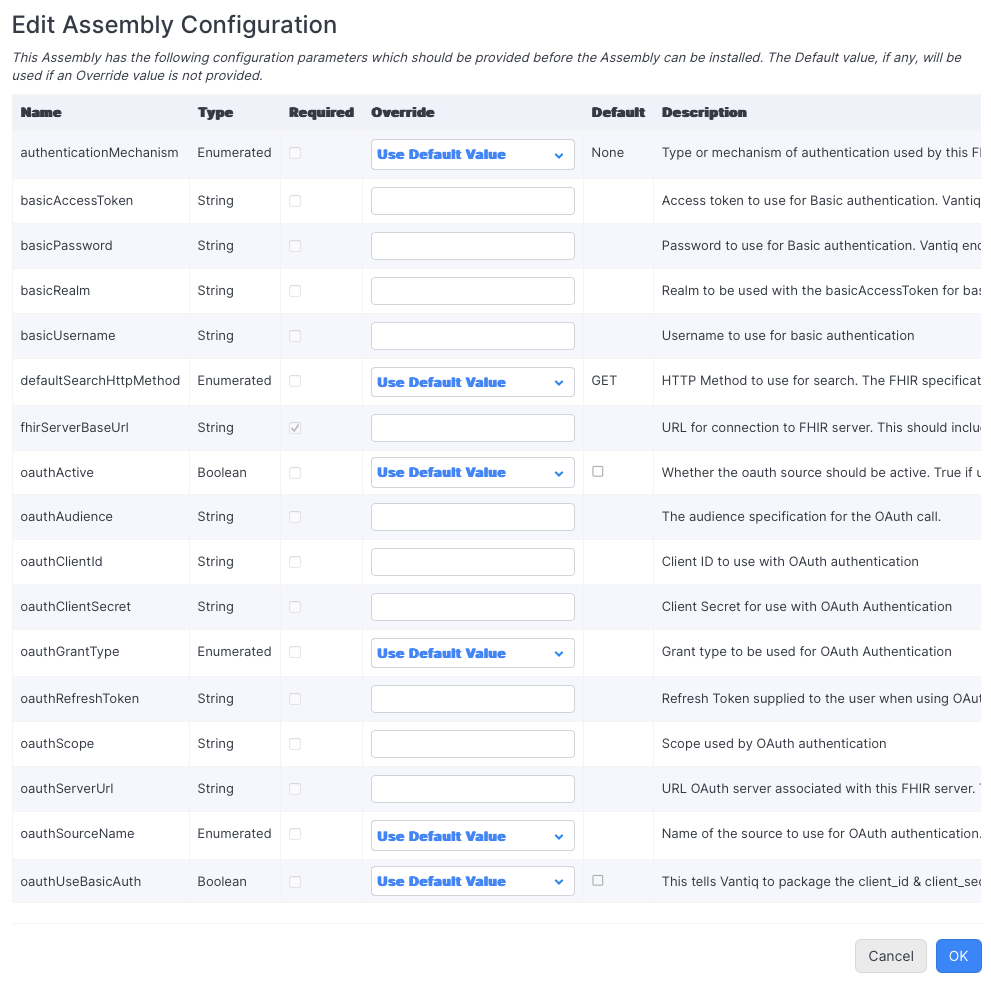

# FHIR Assembly

**Note** The Vantiq assembly defined herein is not a _traditional_ Vantiq Connector in that no separate executable 
is necessary. 
This assembly integrates a Vantiq application with another system (a FHIR server) in a manner native to Vantiq.

## Status

This work is in a preliminary state.  Users should be aware of that.  Any issues encountered should be reported in 
this GIT repo, preferably using the header "FHIR" in the issue title.

FHIR Links contained herein generally refer to R4 version of FHIR.  There are no known reason why other versions 
would not work, R4 is what has been tested against.

## Overview

This module creates a Vantiq assembly that provides for communication with a 
[FHIR server](https://hl7.org/fhir/R4/index.html).  FHIR (Fast Healthcare Interoperability Resources) is
a healthcare information exchange standard that makes use of an HL7-defined set of _resources_
to support information sharing in a number of ways, including, but not limited to, including documents, 
messages, services, and RESTful interfaces.

The assembly created in this project allows a Vantiq user to use the service defined herein to communicate with the 
FHIR server. This is done using the service and associated procedures that are closely tied to FHIR _interactions_.
We assume that the user is familiar with FHIR resources and the interaction interfaces, as the Objects used are the 
native FHIR types presented in a Vail-friendly manner.

This project does NOT provide a FHIR server, nor any new FHIR resource definitions. FHIR is an interoperability 
definition, and there is no point in trying to define another on top of it.  What this project defines is a Vantiq 
Service that provides for the FHIR _interactions_ with that FHIR server in a Vantiq application.

## Prerequisites

Use of this assembly presumes the following

* Vantiq
    * The user is familiar with the Vantiq development environment.
    * The user is familiar with installing an assembly.
    * The user as access to a Vantiq server and namespace into which to install the assembly and perform further
      development.
* FHIR
    * The user is familiar with FHIR resources and services.
    * The user has access to a FHIR server.
        * The type of access defined will determine what interactions the user can perform.  This project does not 
          attempt to determine that or limit it in any way.

## The FHIR Connection Assembly Structure

The FHIR Connection assembly defines a number of Vantiq components used for interacting with the FHIR server.  We 
outline those defined below. These are all found in the package `com.vantiq.fhir`.

### Types

* `FHIRResponse` -- This is the response type from FHIR interactions.
    * `statusCode` -- (Integer) The HTTP status code returned by the underlying REST operation
    * `headers` -- (Object) The HTTP headers returned by the underlying REST operations.  The object returned 
      consists of properties whose name is the header name, and whose value is the header value.
    * `body` -- (Object) The Vantiq Object representation of the FHIR resource returned by the FHIR interaction.  
      Depending upon the interaction, this might be a FHIR resource requested (_e.g._, the _created_
      [Encounter](https://hl7.org/fhir/R4/encounter.html)) or information/errors returned in the form of an 
      [OperationOutcome](https://hl7.org/fhir/R4/operationoutcome.html).
    * These data items are often important to the interpretation of an interaction's outcome.
* `Modifiers` -- This can be used as a general parameter to most operations. This object can contain the following 
  properties.
    * `headers` -- (Object) Any HTTP headers that may be desired (_e.g._, the `If-None-Exist` header used for conditional create)
    * `generalParams` -- (Object) Any _general parameters_ (_e.g._, `_summary`, `_count`) to be used for the 
      interaction. Those of use for what data is returned (such as those mentioned) are accepted.  The `_format` 
      parameter is prohibited here because it alters the encoding of the result.
      
### Services

* `fhirService` -- This is the point of interaction with the FHIR server.  It includes the following procedures and 
  their parameters, most of which are modeled after the similarly named 
  [FHIR _interactions_](https://hl7.org/fhir/R4/http.html).  
    * `create` -- Creates a FHIR Resource
        * `type` -- (String, Required) The name of the resource type
        * `resource` -- (Object, Required) The instance of the resource type
        * `versionId` -- (String) The version id to be associated with the resource created
        * `modifiers` -- (Modifiers) Any modifiers to the interaction
    * `delete` -- Deletes a FHIR Resource or version of a resource
        * `type` -- (String, Required) The name of the resource type
        * `id` -- (String, Required) The id of the resource instance to be deleted
        * `modifiers` -- (Modifiers) Any modifiers to the interaction
    * `history` -- Fetch the history for a resource instance, a resource, or the system as a whole
        * `type` -- (String) The name of the resource type
        * `id` -- (String) The id of the resource instance to be deleted
        * `modifiers` -- (Modifiers) Any modifiers to the interaction
        * If `type` and `id` are provided, return the history of that instance.  If only the `type` is provided, 
          return the history of all instances of that type.  If neither `type` nor `id` are provided, return the 
          history for all instances of all types.
    * `patch` -- Update an existing resource via a set of changes
        * `type` -- (String, Required) The name of the resource type
        * `id` -- (String, Required) The id of the resource instance to be patched
        * `patchCommands` -- (Array of Object, Required) The set of commands to be performed on the instance of the 
          type.  Each command is a Vantiq Object representing the information defined in a
          [JSON Patch](https://datatracker.ietf.org/doc/html/rfc6902) document.
        * `modifiers` -- (Modifiers) Any modifiers to the interaction
    * `read` -- Read a resource's current state
        * `type` -- (String, Required) The name of the resource type
        * `id` -- (String, Required) The id of the resource instance to be read
        * `modifiers` -- (Modifiers) Any modifiers to the interaction
    * `searchCompartment` -- Search a compartment (defined by your FHIR server)
        * `compartment` -- (String, Required) The name of the compartment to be searched
        * `id` -- (String, Required) The id of the compartment to be searched
        * `query` -- (Object, Required) The query over the instance of the compartment
        * `type` -- (String) The type to which to limit the search
        * `modifiers` -- (Modifiers) Any modifiers to the interaction
        * `method` -- (String -- GET or POST) The HTTP method to use. This is rarely needed, but some servers may 
          _encourage_ the use of a specific method. If not specified, it will use the method defined by the 
          `defaultSearchHttpMethod` specified at assembly installation time.
    * `searchSystem` -- Search the entire system (as defined by your FHIR server)
        * `query` -- (Object, Required) The query over the system
        * `modifiers` -- (Modifiers) Any modifiers to the interaction
        * `method` -- (String -- GET or POST) The HTTP method to use. This is rarely needed, but some servers may
          _encourage_ the use of a specific method. If not specified, it will use the method defined by the
          `defaultSearchHttpMethod` specified at assembly installation time.
    * `searchType` -- Search a particular resource type
        * `type` -- (String, Required) The resource type over which to perform the search
        * `query` -- (Object, Required) The query over the system
        * `modifiers` -- (Modifiers) Any modifiers to the interaction
        * `method` -- (String -- GET or POST) The HTTP method to use. This is rarely needed, but some servers may
          _encourage_ the use of a specific method. If not specified, it will use the method defined by the
          `defaultSearchHttpMethod` specified at assembly installation time.
    * `update` -- Update (or create, if not present & supported by the FHIR server) a resource instance
      * `type` -- (String, Required) The name of the resource type
      * `id` -- (String, Required) The id of the resource instance to be updated.
      * `resource` -- (Object, Required) The instance of the resource type
      * `versionId` -- (String) The version id to be associated with the updated resource
      * `modifiers` -- (Modifiers) Any modifiers to the interaction
  * `vread` -- Read a resource version's current state
      * `type` -- (String, Required) The name of the resource type
      * `id` -- (String, Required) The id of the resource instance to be read
      * `versionId` -- (String) The version id to be read.  If missing, this operates the same as a `read` procedure.
      * `modifiers` -- (Modifiers) Any modifiers to the interaction
  * `getCapabilityStatement` -- returns the capability statement for the FHIR server
      * (No parameters)
  * `bundleInteraction` -- perform an interaction that requires a `Bundle` type.  These are typically `batch` or 
    `transaction` interactions, but others may be defined by your FHIR server
      * `bundle` -- (Object, Required) The bundle representing the operation to perform
      * `modifiers` -- (Modifiers) Any modifiers to the interaction
  * `returnLink` -- returns the link provided.  This is typically used for paging operations (following the `next` 
    or `previous` links), but this procedure is agnostic with respect to the purpose of the _link_.
    * `link` -- (String, Required) The link to be returned

### Internal Components

The following Vantiq components may be created via the installation of the assembly. Generally, there is no direct 
manipulation of these items, but you may see references to them in log messages, errors, or other places.

* Vantiq Sources
    * `fhirServer` -- This is a Vantiq REMOTE Source that is used by the `fhirService` to interaction with your FHIR 
      server.
    * `oauthSource` -- This is a Vantiq REMOTE Source this works with the `fhirServer` source to enable OAuth-based 
      authentication.

## FHIR Connection Assembly -- Installation

### Information Required

Installing the FHIR Connection Assembly will require the following information:

* FHIR Server Base URL -- This is the URL of the FHIR server. The use of the `fhirService` will use this URL to 
  construct REST calls to the FHIR server.  If the FHIR server URL includes a _path_ component, that path 
  should be specified ending with a `/`.  This is necessary due to the way the ultimate requests are made.  For 
  example, a HAPI JPA Server typically has a URL of `http://somehost:someport/fhir/`.
* FHIR Server Authentication Information -- you will need to specify any credentials you need to access your FHIR 
  server as well as the mechanism used.  At this time, we support access using no authentication, basic 
  authentication (username & password), and OAuth using _client_credentials_ or _refresh_token_.
* Access to the Vantiq catalog in which the assembly is located.

### Installation of the Assembly

Once you have located the assembly in the catalog, click on it to install.  This will present you with the (rather 
large) set of assembly configuration properties.

Some of these will need to be provided to configure the assembly in your namespace.

#### Required Properties

* `fhirServerBaseUrl` -- A String with the URL of the FHIR server.  As noted above, if the URL contains a _path_ 
  part, the URL should be specified with a trailing slash ('/') -- _e.g.,_ `http://localhost:8090/fhir/`.

#### Optional Properties

The following properties are optional, but may be required in conjunction with other property values.  This is 
mostly based on the value of the first: `authenticationMechanism`.

* `authenticationMechanism` -- this is the type of authentication required for your FHIR server.  The default value 
  is _None_, meaning that no authentication is required.  This is primarily of value for test/development situations.

Depending upon the value provided, you may need to provide other values. These are explained in more detail in the 
[Vantiq REMOTE source documentation](https://dev.vantiq.com/docs/system/sources/remote/)
(referenced here on [dev.vantiq.com](https://dev.vantiq.com)).

If `authenticationMechanism` is _None_, no further property values are required.

If `authenticationMechanism` is _Basic_, then the `basicUsername` and `basicPassword` values must be provided. We 
strongly suggest that at least the `basicPassword` be a value stored in a Vantiq Secret, and provided here using the 
`@secrets(`_secretName_`)` notation.

If `authenticationMechanism` is _OAuth_, then the following values maybe necessary, depending upon the 
`oauthGrantType` provided.  Your system administrator should be able to help with these.

* `oauthActive` -- Must be checked when using the _OAuth_ `authenticationMechanism`.
    * This should be checked ONLY when using the _OAuth_ `authenticationMechanism`.
* `oauthServerUrl` -- The URL of your OAuth server.  This is URL for your OAuth server, and will be consulted to 
  obtain access to the FHIR server when using the _OAuth_ `authenticationMechanism`.
* `oauthSourceName` -- When using the _OAuth_ `authenticationMechanism`, this MUST be set to 
   `com.vantiq.fhir.oauthSource`, which is available from the drop-down menu
* `oauthGrantType` -- one of _client_credentials_ or _refresh_token_
* `oauthClientId` -- The client id you've been provided
* `oauthClientSecret` -- The client secret you've been provided
    * As with the `basicUsername` and `basicPassword` above, we
      strongly suggest that these be stored in a Vantiq Secret, and provided here using the
      `@secrets(`_secretName_`)` notation.
* `oauthRefreshToken` -- A String holding the refresh token used for the _refresh_token_ `oauthGrantType`.
   In this case, the `oauthClientId` and `oauthClientSecret` may be required as well.
* `oauthAudience` & `oauthScope` -- may be required.  Consult your OAuth administrator to see if these are required.
* `oauthUseBasicAuth` -- _true_ if the `oauthClientId` and `oauthClientSecret` should be packaged as Basic 
  authentication to the OAuth server. Consult your OAuth administrator

Once all the appropriate values are completed, press OK.

## FHIR Connection Assembly -- Usage

Once you have installed the assembly, you can add the installed service to your project.

This will provide you with the service & the procedures outline above.

To use the service, you will define your own service(s).  In this simple, case, we've defined 
`com.vantiq.test.fhirExample` with a single procedure `getAPatient`.

If we invoke this using a valid patient id, we'll get back a FHIRResponse with the relevant data.

(Skipped most of the data since it's quite long.)

If we provide an invalid patient id, we'll get back FHIRResponse containing a FHIR OperationOutcome telling us about 
the issue.

# Development using this Git Repo

## Building the FHIR Assembly

To build the FHIR assembly, use the `assemble` task for Gradle.  That is, run the command

`./gradlew fhirAssembly:assemble`

This will produce the 'com.vantiq.fhir.fhirConnection.zip' file in the project's `build/distribution` directory.

Once that is done, you can import the assembly projects to a Vantiq namespace, and, from there, publish these
assemblies to a catalog.  The steps involved are as follows.

## Importing Assemblies

This can be done manually (using the Vantiq IDE to import the generated projects).

However, if importing many projects, use `../gradlew importAssemblies -PfhirAssembliesProfile=<profileName>`

where `<profileName>` is the name of a Vantiq CLI profile that will connect to your publishing namespace.  Other
gradle properties that are used are based on that profile name, and are as follows.

* **\<profileName\>_fhirAssembliesVantiq** -- command to be used as the Vantiq CLI.  Defaults to `vantiq`.

## Publishing Assemblies

Once imported, the assemblies can be published. This can be done manually (using the Vantiq IDE to publish the
generated and imported projects to a Catalog).

However, if importing many projects, use `../gradlew publishAssemblies -PfhirAssembliesProfile=<profileName>`.

In addition to the gradle properties used for import, you can define the following.

* **\<profileName\>_fhirAssembliesCatalog** -- the name of the catalog to which to publish the assemblies.  This is
  required, and may be specified on the command line or in the `gradle.properties` file.
* **changeLog** -- change log entry to include.  A very short (no spaces) description of what this upload entails.

## Use of the Gradle Properties

Generally, the likely behavior is that you would define all of the **\<profileName\>_fhirAssemblies...** properties
in the `gradle.properties` file.  This is not required, but it generally makes your gradle command line easier to
manage.  Then, on the command line, select the profile name to use (`-PfhirAssembliesProfile=...`) and your change
log entry (if appropriate and desired).  The profile name is used to select the other properties so you can keep a
number of them if you have multiple catalogs to maintain.

