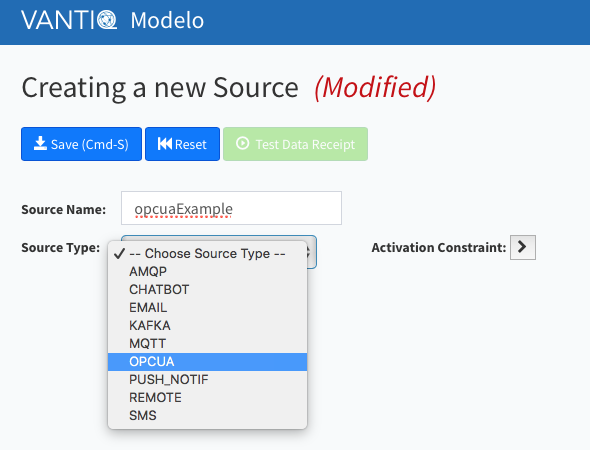
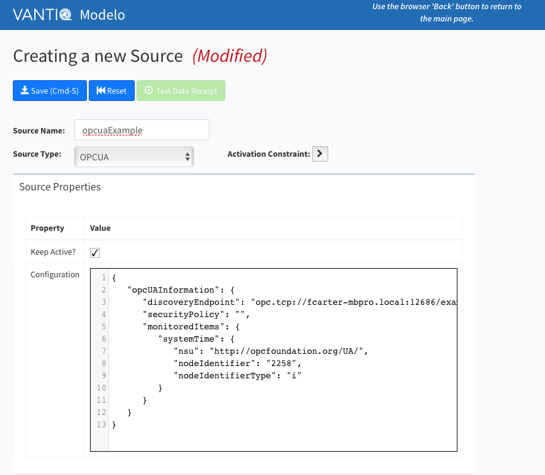

# OPC UA Extension Source

This module contains the source code for the [VANTIQ](https://vantiq.com) OPC UA Source.
OPC (Open Platform Communications) is an interoperability standard for use in the industrial automation space and in other industries.
The [OPC Foundation](https://opcfoundation.org) is responsible for the development and maintenance of this standard.
[OPC Unified Architecture](https://opcfoundation.org/about/opc-technologies/opc-ua/) (OPC UA) is a platform independent service-oriented architecture that integrates all the functionality of the individual OPC Classic specifications into one extensible framework.

The OPC UA Extension Source is an Extension Source for interoperability between OPC UA Servers and the [VANTIQ](https://vantiq.com) system.
This document describes the operation of the source itself as well as how to make use of it within a VANTIQ system.

> Note: VANTIQ Extension Sources are first supported in VANTIQ version 1.23.

## Extension Sources

VANTIQ Extension Sources support the creation of a VANTIQ source.
Within a VANTIQ system, a *source* is the means by which the VANTIQ system communicates with other systems.

Briefly, extension sources connect to the VANTIQ system via a websocket connection, and interact with that system based on five (5) operations.

 - connectExtension -- how the extension source identifies itself to VANTIQ
 - configureExtension -- VANTIQ provides source-specific configuration to the extension source
 - publish -- data sent from VANTIQ to the source
   - Result of a PUBLISH to the source
 - query -- queries sent from VANTIQ to the source with a response required.
   - SELECT statements in VANTIQ
 - notification -- data sent from the source to VANTIQ
   - These appear as a message from the source

More information about how to work with these operations can be found in the [Extension Source SDK for Java](../extjsdk/README.md) documentation.

## OPC UA Extension Source Operation

### Defining the Source in VANTIQ

#### Creating the Source

When creating an OPC UA Extension source,
you must first create the OPC UA source type or implementation.
This is done by using the `opcuaImpl.json` file found in `src/test/resources/opcuaImpl.json`.
To make the source type known to VANTIQ, use the `vantiq` cli command

```
vantiq -s <profileName> load sourceimpls <fileName>`
```

where `<profileName>` is replaced by the VANTIQ profile name, and `<fileName>` is the file to be loaded.

Once that type is loaded,
you can create a source of that type.
This is done by first selecting the OPCUA type for the source,



and then providing a configuration.  We will examine the configuration just below.



#### Configuration

> Note:  It is assumed here that the reader is familiar with OPC UA concepts and terminology.
> This source tries to use terminology familiar to an OPC UA practitioner where possible.

The configuration of a VANTIQ extension source is a JSON document.

For OPC UA sources, the document contains the following properties

 - `discoveryEndpoint` -- This is the URL for the OPC UA server's discovery endpoint. This is the URL that the source will use to connect to the OPC UA server.
 - `securityPolicy` -- This the specification (URI) of the security policy to be used to communicate with the OPC UA server. The security policy includes information about how (and whether) signing and encryption is done. The list of security policy URI's can be found in the OPC UA documentation.
 - `monitoredItems` -- This is the list of items to be monitored by the OPC UA source.  More detail can be found below.

#####<a id="monitored_items"></a>Monitored Items

The OPC UA source can be configured to monitor items (nodes) within the OPC UA server.  Specifically, the source will watch for data value changes for the nodes listed, reporting changes back to the VANTIQ system in the form of a message from the source.

The `monitoredItems` property is a list of individual node specifications to monitor.
Each item is identified by a name (*e.g.* `systemTime`) followed by the specification of the node.
A node specification contains the following properties.

 - `ns` or `nsu` -- These specify the namespace of the node in question. `nsu` specifies the namespace URI.  Alternatively, `ns` can be used specifying the namespace index. The latter is not recommended since namespace indicies are not required to be stable over OPC UA server restarts.
 - `nodeIdentifier` -- this is the identifier for the node within the namespace.
 - `nodeIdentifyerType` -- this specifies how the `nodeIdentifier` is to be interpreted. Node Indentifiers, in OPC UA, can be a String, Numeric (Integer), GUID, or byte string.  These are specified by a `nodeIdentifier` value of `s`, `i`, `g`, or `b`, respectively. If `nodeIdentifierType` is not specified, the default value of `s` is used. That is, the default `nodeIdentifierType` is String.

In the example given, we are monitoring the system time, identified using a numeric identifier of 2258.

### Working with VANTIQ

To a VANTIQ user,
an extension source is indistinguishable from a source provided within the system.
Details about how to interact with a VANTIQ source can be found in the VANTIQ documentation;
here we will provide a few examples.

#### Publish to VANTIQ

To send a message to the OPC UA Source, we might use the following.

```
var someString = ...
PUBLISH {
    intent: "upsert",
    nsu : "urn:eclipse:milo:hello-world",
    nodeIdentifier : "HelloWorld/ScalarTypes/String",
    dataValue : someString
} to SOURCE opcExample
```

This statement sends the message indicated to the source `opcExample`.
There are a few items of interest here.

The `intent` property is used to tell the source what to do with the `publish` message. Here, we use the value `upsert` to specify that the node value (property `dataValue`) should be set to the contents of the variable `someString`.
At present, this is the only `intent` allowed, but that is likely to change in subsequent revisions of this source.

The identification of the node are provided by the `nsu` and `nodeIdentifier` values.  The nodeIdentification properties are the same for the PUBLISH statement as those described in the [monitored items](#monitored_items) section.
You will see this same pattern used in a number of places.

The order of the properties within the message is not important.

#### Query from VANTIQ

To obtain the value of a node,
you can run a query using the SELECT statement.

```
var rowCount = 0
var result = ""

SELECT * FROM SOURCE opcExample as row WITH
    		queryStyle : "NodeId",
            nsu : "urn:eclipse:milo:hello-world",
            nodeIdentifier : "HelloWorld/ScalarTypes/String"
    		// identifierType is String, the default
    {
        rowCount += 1
        log.info("got a row: {}", [row])
        result += row
        result += ":::"
    }
```

This query fetches the value of the specified node from the OPC UA source.
The `nsu` and `nodeIdentifier` (and default for `nodeIdentiferType`) should be familiar.

The `queryStyle` property tells the source that the type of query to run is a value specified by a node id.
Subsequent revisions may include other such styles.

Of particular note is the query specification document contained in the `WITH` clause of the `SELECT` statement.
For working with sources, this is required.
`WHERE` is used only with type-based queries.

#### Receiving Data from the Source

Within the OPC UA source, changes to nodes identified in the [`monitoredItems`](#monitored_items) are sent to the VANTIQ system.
These appear as a message from the source in question.

Within VANTIQ, these messages are handled by RULES.
The following example will make note of the message in VANTIQ log.

```
RULE opcChangeNotification
when MESSAGE ARRIVES FROM opcExample as message

log.info("OpcExample: Node {} has new value {}", [message.nodeIdentification, message.entity])

INSERT INTO opcUpdateOccurence (
	timestamp = now(),
	nodeId = message.nodeIdentification,
	value = message.entity
)
```

The `nodeIdentification` property contains the Node Id, and the `entity` property contains the new value of the node.

### Deploying OPC UA Source

#### Build the OPC UA Source

To create the OPC UA source, clone this [Github Repository](https://github.com/Vantiq/vantiq-extension-sources).
Once that has been done, go into the directory `opcuaSource` within the cloned repository.
To create the OPC UA source executable, run

```
./gradlew clean assemble
```

> Note that the `opcuaSource` build depends on the `extjsdk` module.
> Before building, please build that module.

This will create the distribution in `build/distribution`.  Therein, you will find `opcua.zip` and `opcua.tar` -- these are alternative packaging for the system.  Use whichever you prefer.

Now, you will unzip or untar one of those files to some place in your system where you would like the runtime for the system to be housed.

#### Running the OPC UA Source

Once you have deployed the source extension and created a source in VANTIQ,
you are ready to run the extension.

The underlying sequence of events is as follows:

 - Source is created in VANTIQ
   - When that happens, the source is *up* but not *connected*.
 - The source extension connects to VANTIQ, providing the name of the source on whose behalf it is operating.
   - At this point, the source is *connected* and operational.
   - Any monitored items will start to deliver messages to VANTIQ, *etc*.
 - Once connected, the source can be the target of PUBLISH or SELECT statements.

The sequence above requires that the extension source be told of the VANTIQ to which to connect, appropriate credentials for doing so, and the name of the source it to perform the `connectExtension` operation.

In addition to this information,
the OPC UA extension source will require a bit of permanent storage.
This is called the *storage directory*.
The *storage directory* is used to hold a certificate store for identifying the OPC UA client itself,
and optionally certificates used to authenticate the user to the OPC UA server.

This information be provided in a couple of ways.
The simplest is via command line flags.

```
opcuaSource/bin/opcuaSource -t <token> -s <sourceName> -v <VANTIQ URL> -d <storageDirectory>
```

where

 - *<token>* is a security token defined in the VANTIQ system
  - Alternatively, but not recommended, the `-u <user> -p <password>` combination can be used
 - *<sourceName>* is the name of the source in question
 - *<VANTIQ URL>* is the URL used to connect to the VANTIQ installation, and
 - *<storageDirectory>* is the place on the file system to store information.

Alternatively,
the connection information be provided in a *properties* file.
Specifically, within the *storage directory*,
create a file named `sourceconfig.properties`.
The information required is placed in that file as follows:

```
vantiqUrl = ...
token = ...
sourceName = ...
```

Again, alternatively, but not recommended, you can provide `username` and `password` as

```
username = someUser
password = somePassword
```

An example file might be

```
vantiqUrl = https://dev.vantiq.com
token = _cDWBfZLNO9FkXd-twjwKnVIBZSGwns35nF4nQFV_ps=
sourceName = opcuaExample
```

> Note that this token will not work -- you will need to create your own
> within a VANTIQ installation