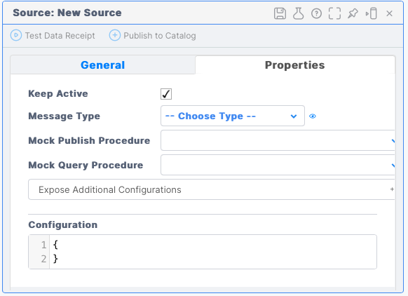

# Python Execution Connector/Extension Source

This module contains the source code for the [Vantiq](https://vantiq.com) Python Execution Connector or Extension Source.

The Python Execution Connector (Extension Source) is a Connector that provides for the execution of Python code. The connector is used to allow Vantiq/VAIL procedures to request the execution
of Python code and the return of the results to the Vantiq server.

This document describes the operation of the source itself as well as how to make use of it within a Vantiq system.

> Note: Vantiq Extension Sources are first supported in Vantiq version 1.23.

## Connectors or Extension Sources

Vantiq Connectors (_aka_ Extension Sources) support the creation of a Vantiq source.
Within a Vantiq system, a *source* is the means by which the Vantiq system communicates with other systems.

Briefly, extension sources connect to the Vantiq system via a websocket connection, and interact with that system based on five (5) operations.

 - connectExtension -- how the extension source identifies itself to Vantiq
 - configureExtension -- Vantiq provides source-specific configuration to the extension source
 - publish -- data sent from Vantiq to the source
   - Result of a PUBLISH to the source
   - (Note: the Python Execution connector does not respond to _publish_ operations.)
 - query -- queries sent from Vantiq to the source with a response required.
   - SELECT statements in Vantiq
 - notification -- data sent from the source to VANTIQ
   - These appear to Vantiq as a message from the source

More information about how to work with these operations can be found in the [Extension Sources Overview](../../README.md) documentation.

Note: The term _extension source_ is an older term, but it is still evident in the API. That said, this document will use the term _connector_.

## Python Execution Connector Operation

### Warning

This connector provides the ability to execute arbitrary Python code. That code will run in the same context in which the connector runs. That is, it will start in the same working directory and run with the same privileges at the connector itself.

This means that _malicious_ code could be executed, and it could do anything that any other Python script could do. While this is generally the goal, it is important to recognize this and take appropriate precautions to control developer access to the namespace in which the Python Execution Connector is defined.

Note that this is no different than any other connector (JDBC, JMS, etc.) where the connector can affect the state of the system to which it is connected. The execution of Python code just makes the possibilities more obvious.

### Defining the Source in Vantiq

#### Creating the Source

When creating a source for the Python Execution connector,
you must first create the Python Execution source type or implementation.
This is done by using the `pythonExecImpl.json` file found in
`src/main/resources/pythonExecImpl.json`.
To make the source type known to Vantiq, use the `vantiq` cli command

```
vantiq -s <profileName> load sourceimpls <fileName>`
```

where `<profileName>` is replaced by the Vantiq profile name, and `<fileName>` is the file to be loaded, in this case, the `pythonExecImpl.json` file mentioned above.

Once that type is loaded,
you can create a source of that type.
This is done by first selecting the `PYTHONEXECUTION` type for the source,


and then providing a configuration.  We will examine the configuration just below.



#### <a name="configuration" id="configuration"></a>Configuration

> Note:  It is assumed here that the reader is familiar with Python concepts and terminology.
> This source tries to use terminology familiar to a Python practitioner where possible.

The configuration of a Vantiq connector is a JSON document.

For Python Execution sources, the config document format parallels those of other connectors.
Specifically, the document contains a root named `config`, which, in turn, contains an element
named `'pythonExecConfig`, which contains the `general` section. This section can contain the following properties:

- `codeCacheSize` -- this is the number of compiled python code entries this connector will contain. The default is 128, and that should be sufficient for most purposes.
- `returnRuntimeInformation` -- this instructs the connector to return runtime information as part of the return from code execution. This is primarily for collecting performance information. It defaults to `false`.
    - The return of runtime information is supported only when the connector is returning the results directly.  In cases where the executed code is sending results (see `codeHandlesReturn` [below](#withParameters)), there is no vehicle for the return of runtime information.

An example configuration document specifying the return of runtime information would look like the following:

```
{ "config": {
    "pythonExecConfig": {
        "general": {
            "returnRuntimeInformation" : true
        }
    }
} 
```

If no changes to the defaults are required, no configuration is necessary.


### Working with Vantiq

To a Vantiq user,
an extension source is indistinguishable from a source provided within the system.
Details about how to interact with a Vantiq source can be found in the Vantiq documentation;
here we will provide a few examples.


#### Query from Vantiq

(See the [Warning](#warning) section.)

To execute some Python code,
you can run a query using the SELECT statement.

```js
    var pythonCode = "print('loop count', loop_count)"
    
    var result = SELECT * FROM SOURCE MyPythonExecSource
        WITH name = "py_code_example", code = pythonCode, presetValues = { loop_count: 20 }
    log.info("Got result: {}", [result])
```

This query runs the code in the variable `pythonCode`, in this case, a `print` statement.

The following works in a similar way, but instructs the connector to fetch the Python script from a Vantiq Document (this is probably a more common case).

```js
    var result
    var allResults = []
    for (result in SELECT * FROM SOURCE MyPythonSource
        WITH script = "myPythonDoc",
             codeHandlesReturn = true,
             presetValues = { loop_count: 20 } ) {
      log.info("Got (partial) document result: {}", [result])
      allResults.push(result)
    }
``` 

This query runs the python code contained in the document _myPythonDoc_.

Some Python code that would run using this call might be the following:

```python
import asyncio
import uuid

async def looper(count):
    global connector_context
    global connector_connection
    print('Looper: Context: ', connector_context)
    print('Looper: Our source is: ', connector_connection.get_source())

    try:
        for i in range(count-1):
            print('Looper: In loop, returning results for iteration: ', i)
            await connector_connection.send_query_response(connector_context, 100, 
                                                           {'item': 'I am list item {0}'.format(i)})
        print('Looper: In loop, returning final result')
        await connector_connection.send_query_response(connector_context, 200, {'item': 'I am the last item'})
        await connector_connection.send_notification({'notify_msg':
                                                      'note this is a notification: ' + str(uuid.uuid4())})

        print('Connector connection is: ', connector_connection)
        print('Looper: Loop completed')
    except Exception as exc:
        print('Looper TRAPPED EXCEPTION', exc)

def main():
    print('Looper -- in main')
    loop = asyncio.get_event_loop()
    tasks = []
    tasks.append(loop.create_task(looper(loop_count)))

    
if __name__ == '__main__':
    main()
```

(Note that `loop_count` is provided by the connector based in the query `presetValues` parameters.)

#####  <a name="withParameters" id="withParameters"></a>Query With Parameters

You will note that the SELECT queries above each have an associated _WITH_ clause.
The _WITH_ is used to specify special instructions for the execution of the query, and the items specified in the _WITH_ clause are sent to the connector.  The following _WITH_ clause parameters are defined as part of this connector.

- `code` (String) -- This specifies the code to run. 
- `name` (String) -- This specifies the name to associate with the `code` to be run. The `name` specified here is used for naming the code in the cache.
- `script` (String) -- This is the name of the Vantiq document from which to obtain the code to run.

Note that `code` and `name` can be provided together, but when `script` is used, that document name is used as the cached code's name.  Thus, `name` cannot be specified along with `script`.

- `presetValues` (Object) -- This is used to set Python global variables for the executed code to access. This parameter should be a Vantiq object.  Each property within the object will create a Python global variable whose name is the property name, and whose value is the property value.  In the examples shown above, you can see that the Python code contains a reference to `loop_count`, and the associated query sets that value via the `presetValues` parameter.
- `codeHandlesReturn` (boolean) -- When `true`, this specifies that the executed code returns its own results (and errors, if necessary).  When `false` or absent, the connector assumes responsibility to returning the results (as outlined [below](#returningData).
- `limitReturnTo` (List of String) -- When `codeHandlesReturn` is `false`, this instructs the connector to limit the values it returns to the (Python) variables in this list.

##### <a name="returningData" id="returningData"></a>Returning Data

When code is executed, it is generally the case that the caller is interested in the result.
Data can be returned in two ways.

When `codeHandlesReturn` is `false` or missing, the connector will, upon completion of the execution, return the values of the Python global variables at the end of execution. Specifically,
the connector will return a single result consisting of the following properties;

- `pythonCallResults` (Object) -- this is a VAIL object containing properties corresponding to the Python global variables of the code executed.  All Python global variables that can be encoded in JSON are returned unless limited by the `limitReturnTo` parameter.  If `limitReturnTo` is specified, then only the Python global variables listed are returned.
- `connectorRuntimeInfo` (Object) -- this is a VAIL object containing some runtime information if 1) the connector has been configured to return such information (see `returnRuntimeInformation` [above](#configuration)), and 2) that `codeHandlesReturn` is absent or `false`.  When present, the value returned may contain some of the following properties:
    - `totalTime` -- the amount of time used to run the code
    - `executionTime` -- the amount of time spent executing the code sent down
    - `compileTime` -- the amount of time spent compiling the code.  If missing, no compilation was performed.
    - `currentCacheSize`-- the number of items in the compiled code cache
    - `cacheCapacity`-- the size (in terms of number of items) in the compiled code cache.

When `codeHandlesReturn` is `true`, the executed code takes on the responsibility for sending data back. This is done by calling the Python Connector SDK calls `send_query_response()` or `send_query_error()`. Please see that documentation for details about these calls.

To provide context for the operation of your code, the following Python global variables will be set.

- `__name__` (String) -- set to `__main__`
- `__file__` (String) -- set to the name of the _file_ being executed.  If `code` and `name` are provided, `__file__` will be the `name` value.  If `script` is provided, that will be used as the name.  If no name is otherwise available, the connector will generate a name.  
- `connector_connection` (`VantiqSourceConnection`) -- this is the source connection that can be used to send results back.
- `connector_context` (dict) -- this is the _context_ parameter required by the `send_query_response()` and `send_query_error()` methods for associating the results of the operation with the caller in the Vantiq server.

In addition, any values specified in the `presetValues` parameter will be set as global variables.

#### Receiving Data from the Source

Although probably unusual, the Python code being executed can send events to the associated Vantiq source. This is done using the `send_notification()` method in the Vantiq Connector SDK. This is a method associated with the `connector_connection` global variable outlined above.  To make such a call, use

```python
    await connector_connection.send_notification({'id': str(uuid.uuid4())})
```

That will send an event from the connector's source containing the values specified.

On the Vantiq side, assuming our source is named `pythonSource`, we would define a rule as follows:

```
RULE pythonSourceEvebt
WHEN EVENT OCCURS ON "/sources/pythonSource" as sourceEvent

// Grab the actual value from the event
var message = sourceEvent.value

log.info("Got a message: {}", [message])

```

### Deploying a Python Execution Connector

You can build the Python execution connector yourself, or, more commonly, simply install using `pip` (or equivalent).

#### Install

```shell
    pip install vantiqPythonExecConnector
```

Once this is done, you can execute the connector by running the command

```
    vantiqPythonExecConnector
```

once the configuration file is in place (see [below](#runningConnector)).

#### Build the Connector

To build the connector, clone this [Github Repository](https://github.com/Vantiq/vantiq-extension-sources).
Once that has been done, run

```
./gradlew pythonExecSource:clean pythonExecSource:assemble
```

This will create the distribution in `dist`.

#### <a name="runningConnector" id="runningConnector"></a>Running the Connector

Once you have obtained the connector and created a source in Vantiq,
you are ready to run the extension.

The underlying sequence of events is as follows:

 - Source is created in Vantiq
   - When that happens, the source is *up* but not *connected*.
 - The source extension connects to Vantiq, providing the name of the source on whose behalf it is operating.
   - At this point, the source is *connected* and operational.
 - Once connected, the source can be the target of SELECT statements.

The sequence above requires that the connector be told of the Vantiq installation to which to connect, appropriate credentials for doing so, and the name of the source it uses to perform the `connectExtension` operation.

This information should be provided in a configuration file. 
(Please read the [Connector SDK's server config documentation](../../extpsdk/README.md#serverConfig) first.)
Specifically, create a file named `server.config` in a `serverConfig` directory within the working directory in which the connector runs.

The information required is placed in that file as follows:

```
targetServer = ...
authToken = ...
sources = ...
```

An example file might be

```
targetServer = https://dev.vantiq.com
authToken = _cDWBfZLNO9FkXd-twjwKnVIBZSGwns35nF4nQFV_ps=
sources = pythonSource
```

For users who may not want to write the `authToken` property to a file because of its sensitive nature, set the environment variable `CONNECTOR_AUTH_TOKEN` to its value. If the `authToken` is specified in the `server.config` document, that value will take precedence.
Otherwise, if the `authToken` is not set in the configuration file, the system will retrieve whatever value is provided in the environment variable.

> Note that this token will not work -- you will need to create your own
> within a Vantiq installation

You should also provide an appropriate `logger.ini` file in the same directory.
An example file is provided at `src/test/resources/logger.ini` in this project.

#### Creating a Docker Image for your Connector

The general process for creating a docker image is described in the Extension Sources Overview.

However, except for the most trivial cases, you will generally want to include other Python packages in the installation within which the connector runs.  If, for example, you are using some machine learning functions in the code to run, you will want to have the appropriate packages installed in the connector's Python environment.

In the case of a Docker image, each such image is its own environment.  Consequently, you must provide for the installations of the Python packages for each Docker image created.

To do this, we make use of the `connectorSpecificInclusions` property to perform the build. The `connectorSpecificInclusions` identifies a directory that contains files that are to be included in the connector's Docker image.  For this, we require that that property be specified, and that the directory specified contains a file named `localRequirements.txt`.  This should be a file in the [pip requirements format](https://pip.pypa.io/en/stable/reference/requirements-file-format/).  This file will be provided to pip as part of the Docker image build to load the Python packages required by this connector.

In the rare case where no other Python packages are necessary, the `localRequirements.txt` file can be empty.

For example, if one were expecting to run Python code making use of the _numpy_ package, one would create a `localRequirements.txt` file with the following contents:

```
numpy
```

Assuming that the file is placed in the `/Users/me/pythonReqs` directory, one could use the following command to create a Docker image for your use.

```shell
./gradlew -PconnectorSpecificInclusions=/Users/me/pythonReqs \
          -PdockerRegistry=docker.io \
          -PpathToRepo=myorg \
          -PrepositoryName=numpyEnabledPyExecSource \
          -PimageTag=1.0.1 \
       pythonExecSource:buildImages
```

This would produce a docker image named `docker.io/myorg/numpyenabledpyexecsource:1.0.1`.

# Copyright and License

Copyright &copy; 2022 Vantiq, Inc.  Code released under the [MIT license](../LICENSE.txt).
